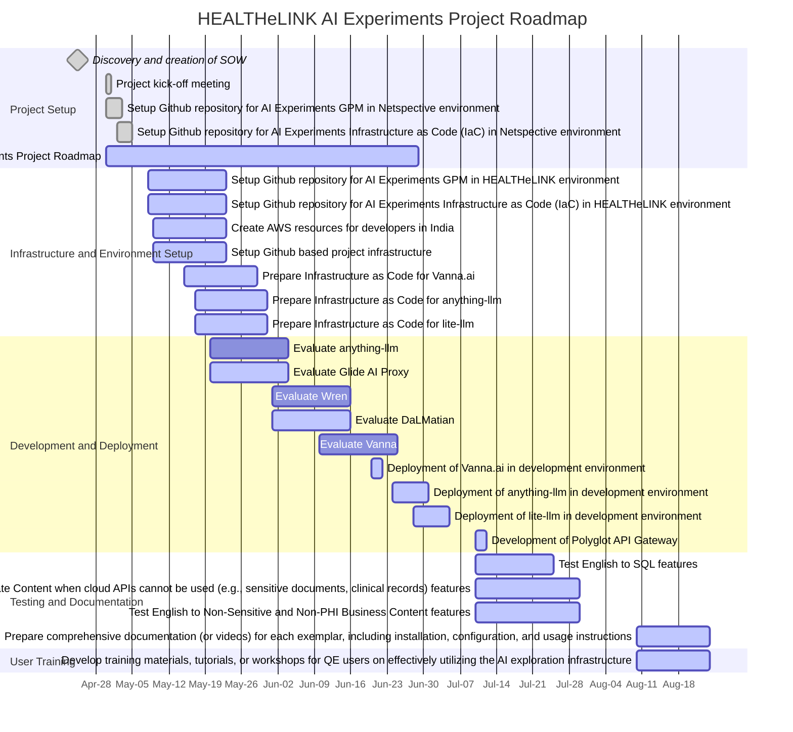

This roadmap outlines the key milestones and deliverables for HEALTHeLINK AI experiment's development and launch. As we gear towards creating a product that meets the needs , our focus will remain unwavering on offering a seamless compliance solution.
 
 

 

