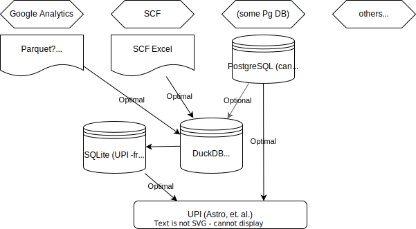

# DuckDB-based Ingestion Center UDI-SII for BZO and Foreign structured content

Universal Data Infrastructure (UDI) Service Integration & Interoperability (SII)
content and scripts library contains a Deno module which generates DDL for
DuckDB which acts as an _Ingestion and Ingres Center_ (`IIC`) for either
non-sensitive (no secrets) or sensitive (with secrets) structured content such
as `*.csv`, `.parquet`, `.xml`, `*.json`, plus direct PostgreSQL, SQLite, and
MySQL connections.



## Usage

The most common use case is to run `./udictl.ts ingest` which generates DuckDB
Ingestion Center (`IC`) SQL DDL, prepares the DuckDB IC database in memory by
default, and then exports that database's data into SQLite database, called
`udi-sii-prime.sqlite.db` by default. Use `--destroy-existing` to delete
existing databases or leave it out to append/update data. The default behavior
is to use DuckDB in-memory processing because the data UPI (e.g. Astro or Node)
will use will be in SQLite format.

```bash
$ cd udi-sii                                            # all scripts assume this is current working directory
$ ./udictl.ts emit-duckdb-ddl                           # if you want to see the generated DDL before executing
$ ./udictl.ts governance-docs-sh | bash                 # re-generate all governance/schema-doc-auto files
$ ./udictl.ts emit-ingest-sh --destroy-existing         # for inspection of what commands will run
$ ./udictl.ts emit-ingest-sh --destroy-existing | bash  # for execution, udi-sii-prime.sqlite.db will be updated
```

NOTE: `duckdb` and `sqlite3` commands are in local `bin` directory (see
[bin/README.md](bin/README.md)).

## Schema Documentation

The following databases and schemas are available, see
[governance/schema-doc-auto](./governance/schema-doc-auto/README.md) for more
information:

- [udi-sii-prime.sqlite.db](./governance/schema-doc-auto/udi-sii-prime.sqlite.db/README.md)

You should regularly do this to update the documentation (using `tbls` command):

```bash
$ ./udictl.ts governance-docs-sh | bash
```

## Directory Structure

Ingestion sources are maintained in `content`, see
[Structured Content Catalog](./content/README.md#catalog).

```
/
├── udi-sii/
│   │                                 
│   ├── bin/                          # all binaries that are not "normal" to base Linux systems
|   |   ├── duckdb*                   # the primary ingestion utility
|   |   ├── sqlite3*                  # our canonical SQL store utility
│   │   └── tbls*                     # schema documentation generator
│   │
│   ├── content/                      # all structured content such as `.csv`, `.json`, etc.
|   |   ├── x1.csv                    # `.csv`, `.parquet`, `.json`, and anything DuckDB supports
|   |   ├── x2.json
|   |   ├── x3.parquet
│   │   └── sensitive-y.json          # files with secrets must start with "sensitive-" for .gitignore
│   │
│   ├── governance/                   # data governance content (docs, guidelines, etc.)
|   |   ├── schema-doc-auto/          # auto-generated schema documentation for UDI-SII databases
│   │   └── architecture.drawio.svg   # overall strategy
│   │
|   ├── udi-sii-prime.sqlite.db       # SQLite generated from DuckDB Ingestion Center, should be used in UPI
│   └── udictl.ts                     # main "controller" script, run `./udictl.ts --help`
```

## TODO

- Integrate DuckDB Excel extension or just [sidwebworks/zod-xlsx](A xlsx based
  resource validator using Zod schemas https://github.com/sidwebworks/zod-xlsx)
  to be able to process any Excel sources.
- Consider using [Nango](https://www.nango.dev/) to get, store, manage, and use
  OAuth tokens for APIs.
- Check out
  [projectdiscovery/katana](https://github.com/projectdiscovery/katana)
  single-binary CLI for crawling and spidering web content. This might be a
  great option to acquire content and ingest it into SQLite along with
  searchable meta-data.
