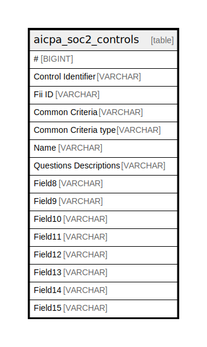

# aicpa_soc2_controls

## Description

<details>
<summary><strong>Table Definition</strong></summary>

```sql
CREATE TABLE aicpa_soc2_controls("#" BIGINT, "Control Identifier" VARCHAR, "Fii ID" VARCHAR, "Common Criteria" VARCHAR, "Common Criteria type" VARCHAR, "Name" VARCHAR, "Questions Descriptions" VARCHAR, Field8 VARCHAR, Field9 VARCHAR, Field10 VARCHAR, Field11 VARCHAR, Field12 VARCHAR, Field13 VARCHAR, Field14 VARCHAR, Field15 VARCHAR)
```

</details>

## Columns

| Name                   | Type    | Default | Nullable | Comment |
| ---------------------- | ------- | ------- | -------- | ------- |
| #                      | BIGINT  |         | true     |         |
| Control Identifier     | VARCHAR |         | true     |         |
| Fii ID                 | VARCHAR |         | true     |         |
| Common Criteria        | VARCHAR |         | true     |         |
| Common Criteria type   | VARCHAR |         | true     |         |
| Name                   | VARCHAR |         | true     |         |
| Questions Descriptions | VARCHAR |         | true     |         |
| Field8                 | VARCHAR |         | true     |         |
| Field9                 | VARCHAR |         | true     |         |
| Field10                | VARCHAR |         | true     |         |
| Field11                | VARCHAR |         | true     |         |
| Field12                | VARCHAR |         | true     |         |
| Field13                | VARCHAR |         | true     |         |
| Field14                | VARCHAR |         | true     |         |
| Field15                | VARCHAR |         | true     |         |

## Relations



---

> Generated by [tbls](https://github.com/k1LoW/tbls)
