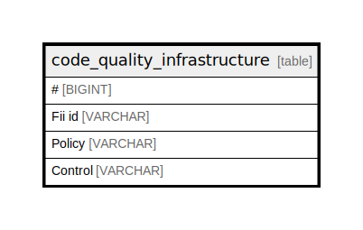

# code_quality_infrastructure

## Description

<details>
<summary><strong>Table Definition</strong></summary>

```sql
CREATE TABLE code_quality_infrastructure("#" BIGINT, "Fii id" VARCHAR, "Policy" VARCHAR, Control VARCHAR)
```

</details>

## Columns

| Name    | Type    | Default | Nullable | Comment |
| ------- | ------- | ------- | -------- | ------- |
| #       | BIGINT  |         | true     |         |
| Fii id  | VARCHAR |         | true     |         |
| Policy  | VARCHAR |         | true     |         |
| Control | VARCHAR |         | true     |         |

## Relations



---

> Generated by [tbls](https://github.com/k1LoW/tbls)
