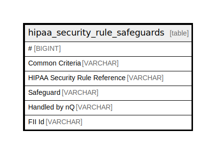

# hipaa_security_rule_safeguards

## Description

<details>
<summary><strong>Table Definition</strong></summary>

```sql
CREATE TABLE hipaa_security_rule_safeguards("#" BIGINT, "Common Criteria" VARCHAR, "HIPAA Security Rule Reference" VARCHAR, Safeguard VARCHAR, "Handled by nQ" VARCHAR, "FII Id" VARCHAR)
```

</details>

## Columns

| Name                          | Type    | Default | Nullable | Comment |
| ----------------------------- | ------- | ------- | -------- | ------- |
| #                             | BIGINT  |         | true     |         |
| Common Criteria               | VARCHAR |         | true     |         |
| HIPAA Security Rule Reference | VARCHAR |         | true     |         |
| Safeguard                     | VARCHAR |         | true     |         |
| Handled by nQ                 | VARCHAR |         | true     |         |
| FII Id                        | VARCHAR |         | true     |         |

## Relations



---

> Generated by [tbls](https://github.com/k1LoW/tbls)
