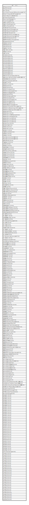

# scf

## Description

<details>
<summary><strong>Table Definition</strong></summary>

```sql
CREATE TABLE scf("SCF Domain" VARCHAR, "SCF Control" VARCHAR, "SCF #" VARCHAR, "Secure Controls Framework (SCF)
Control Description" VARCHAR, "Methods To Comply With SCF Controls" VARCHAR, "Evidence Request List (ERL) #" VARCHAR, "SCF Control Question" VARCHAR, "Relative Control Weighting" BIGINT, "Function Grouping" VARCHAR, "SCRM
Tier 1
Strategic" VARCHAR, "SCRM
Tier 2
Operational" VARCHAR, "SCRM
Tier 3
Tactical" VARCHAR, "SP-CMM 0
Not Performed" VARCHAR, "SP-CMM 1
Performed Informally" VARCHAR, "SP-CMM 2
Planned & Tracked" VARCHAR, "SP-CMM 3
Well Defined" VARCHAR, "SP-CMM 4
Quantitatively Controlled" VARCHAR, "SP-CMM 5
Continuously Improving" VARCHAR, "AICPA
TSC 2017
(Controls)" VARCHAR, "AICPA
TSC 2017
(Points of Focus)" VARCHAR, "BSI 
Standard 200-1" VARCHAR, "CIS
CSC
v8.0" VARCHAR, "COBIT
2019" VARCHAR, "COSO
v2017" VARCHAR, "CSA
CCM
v4" VARCHAR, "CSA
IoT SCF
v2" VARCHAR, "ENISA
v2.0" VARCHAR, GAPP VARCHAR, "IEC 62443-4-2" VARCHAR, "ISO
22301
v2019" VARCHAR, "ISO
27001
v2013" VARCHAR, "ISO
27001
v2022" VARCHAR, "ISO
27002
v2013" VARCHAR, "ISO
27002
v2022" VARCHAR, "ISO 
27017
v2015" VARCHAR, "ISO 
27018
v2014" VARCHAR, "ISO
27701 
v2019" VARCHAR, "ISO
29100
v2011" VARCHAR, "ISO
31000
v2009" VARCHAR, "ISO
31010
v2009" VARCHAR, "MPA 
Content Security Program
v5.1" VARCHAR, "NIAC
Insurance Data Security Model Law (MDL-668)" VARCHAR, "NIST
AI RMF
AI 100-1
v1.0" VARCHAR, "NIST Privacy Framework
v1.0" VARCHAR, "NIST
SSDF" VARCHAR, "NIST
800-37 
rev 2" VARCHAR, "NIST
800-39" VARCHAR, "NIST
800-53
rev4" VARCHAR, "NIST
800-53 rev4
(low)" VARCHAR, "NIST
800-53 rev4
(moderate)" VARCHAR, "NIST
800-53 rev4
(high)" VARCHAR, "NIST
800-53
rev5" VARCHAR, "NIST
800-53
rev5
(privacy)" VARCHAR, "NIST
800-53
rev5
(low)" VARCHAR, "NIST
800-53
rev5
(moderate)" VARCHAR, "NIST
800-53
rev5
(high)" VARCHAR, "NIST
800-53
rev5
(NOC)" VARCHAR, "NIST
800-63B
(partial mapping)" VARCHAR, "NIST
800-82 rev2
Low Impact 
ICS Overlay" VARCHAR, "NIST
800-82 rev2
Moderate Impact 
ICS Overlay" VARCHAR, "NIST
800-82 rev2
High Impact 
ICS Overlay" VARCHAR, "NIST
800-160" VARCHAR, "NIST
800-161
rev 1" VARCHAR, "NIST
800-161
rev 1
C-SCRM Baseline" VARCHAR, "NIST
800-161
rev 1
Flow Down" VARCHAR, "NIST
800-161
rev 1
Level 1" VARCHAR, "NIST
800-161
rev 1
Level 2" VARCHAR, "NIST
800-161
rev 1
Level 3" VARCHAR, "NIST 
800-171
rev 2" VARCHAR, "NIST 
800-171A" VARCHAR, "NIST
800-172" VARCHAR, "NIST
800-218
v1.1" VARCHAR, "NIST
CSF
v1.1" VARCHAR, "OWASP
Top 10
v2021" VARCHAR, "PCIDSS
v3.2" VARCHAR, "PCIDSS
v4.0" VARCHAR, "Shared Assessments SIG 2022" VARCHAR, "Shared Assessments SIG 2023" VARCHAR, "SWIFT
CSF
v2021" VARCHAR, "TISAX
ISA v5.1.0" VARCHAR, "UL
2900-1" VARCHAR, "US
C2M2
v2.1" VARCHAR, "US
CERT RMM
v1.2" VARCHAR, "US
CISA
CPG
v2022" VARCHAR, "US
CJIS Security Policy 5.9" VARCHAR, "US
CMMC 2.0
Level 1" VARCHAR, "US
CMMC 2.0
Level 2" VARCHAR, "US
CMMC 2.0
Level 3" VARCHAR, "US
CMS
MARS-E v2.0" VARCHAR, "US
COPPA" VARCHAR, "US
DFARS
Cybersecurity" VARCHAR, "US
FACTA" VARCHAR, "US
FAR
52.204-21" VARCHAR, "US
FAR
Section 889" VARCHAR, "US
FDA
21 CFR Part 11" VARCHAR, "US
FedRAMP" VARCHAR, "US
FedRAMP
(low)" VARCHAR, "US
FedRAMP
(moderate)" VARCHAR, "US
FedRAMP
(high)" VARCHAR, "US
FedRAMP
(LI-SaaS)" VARCHAR, "US
FERPA" VARCHAR, "US
FFIEC" VARCHAR, "US
FINRA" VARCHAR, "US
FTC Act" VARCHAR, "US
GLBA
CFR 314" VARCHAR, "US
HIPAA" VARCHAR, "HIPAA - HICP
Small Practice" VARCHAR, "HIPAA - HICP
Medium Practice" VARCHAR, "HIPAA - HICP
Large Practice" VARCHAR, "US
IRS 1075" VARCHAR, "US
ITAR Part 120
(limited)" VARCHAR, "US
NERC
CIP" VARCHAR, "US
NISPOM" VARCHAR, "US
NNPI
(unclass)" VARCHAR, "US
Privacy Shield" VARCHAR, "US
SOX" VARCHAR, "US
SSA 
EIESR
v8.0" VARCHAR, "US
StateRAMP
Low
Category 1" VARCHAR, "US
StateRAMP
Low+
Category 2" VARCHAR, "US
StateRAMP
Moderate
Category 3" VARCHAR, "US
TSA / DHS
1580/82-2022-01" VARCHAR, "US - AK
PIPA" VARCHAR, "US - CA
SB327" VARCHAR, "US-CA
CPRA
(Nov 2022)" VARCHAR, "US - CA
SB1386" VARCHAR, "US - CO
Colorado Privacy Act" VARCHAR, "US - IL
BIPA" VARCHAR, "US - IL
IPA" VARCHAR, "US - IL
PIPA" VARCHAR, "US-MA
201 CMR 17.00" VARCHAR, "US - NV
SB220" VARCHAR, "US - NY
DFS
23 NYCRR500" VARCHAR, "US - NY
SHIELD Act
S5575B" VARCHAR, "US - OR
646A" VARCHAR, "US - SC
Insurance Data Security Act" VARCHAR, "US - TX
BC521" VARCHAR, "US-TX
Cybersecurity Act" VARCHAR, "US-TX DIR Control Standards 2.0" VARCHAR, "US-TX
TX-RAMP
Level 1" VARCHAR, "US-TX
TX-RAMP
Level 2" VARCHAR, "US-TX
SB820" VARCHAR, "US-VA
CDPA
2023" VARCHAR, "US-VT
Act 171 of 2018" VARCHAR, "EMEA
EU
DORA" VARCHAR, "EMEA
EU ePrivacy
(draft)" VARCHAR, "EMEA
EU
GDPR" VARCHAR, "EMEA
EU
PSD2" VARCHAR, "EMEA
Austria" VARCHAR, "EMEA
Belgium" VARCHAR, "EMEA
Czech Republic" VARCHAR, "EMEA
Denmark" VARCHAR, "EMEA
Finland" VARCHAR, "EMEA
France" VARCHAR, "EMEA
Germany" VARCHAR, "EMEA
Germany
C5-2020" VARCHAR, "EMEA
Greece" VARCHAR, "EMEA
Hungary" VARCHAR, "EMEA
Ireland" VARCHAR, "EMEA
Israel
CDMO
v1.0" VARCHAR, "EMEA
Israel" VARCHAR, "EMEA
Italy" VARCHAR, "EMEA
Luxembourg" VARCHAR, "EMEA
Netherlands" VARCHAR, "EMEA
Norway" VARCHAR, "EMEA
Poland" VARCHAR, "EMEA
Portugal" VARCHAR, "EMEA
Russia" VARCHAR, "EMEA
Saudi Arabia
Critical Security Controls" VARCHAR, "EMEA
Saudi Arabia
SAMA CSFv1.0" VARCHAR, "EMEA
Saudi Arabia
ECC-12018" VARCHAR, "EMEA
Saudi Arabia
OTCC-1 2022" VARCHAR, "EMEA
Slovak Republic" VARCHAR, "EMEA
South Africa" VARCHAR, "EMEA
Spain" VARCHAR, "EMEA
Spain
CCN-STIC 825" VARCHAR, "EMEA
Sweden" VARCHAR, "EMEA
Switzerland" VARCHAR, "EMEA
Turkey" VARCHAR, "EMEA
UAE" VARCHAR, "EMEA
UK
CAF v3.1" VARCHAR, "EMEA
UK
Cyber Essentials" VARCHAR, "EMEA
UK
DPA" VARCHAR, "EMEA
UK
GDPR" VARCHAR, "APAC
Australia
Privacy Act" VARCHAR, "APAC
Australian Privacy Principles" VARCHAR, "APAC
Australia
ISM 2022" VARCHAR, "APAC
Australia
IoT Code of Practice" VARCHAR, "APAC
Australia
Prudential Standard CPS234" VARCHAR, "APAC
China
Data Security Law (DSL)" VARCHAR, "APAC
China
DNSIP" VARCHAR, "APAC
China
Privacy Law" VARCHAR, "APAC
Hong Kong" VARCHAR, "APAC
India
ITR" VARCHAR, "APAC
Indonesia" VARCHAR, "APAC
Japan
APPI" VARCHAR, "APAC
Japan
ISMAP" VARCHAR, "APAC
Malaysia" VARCHAR, "APAC
New Zealand Health ISF" VARCHAR, "APAC
New Zealand
NZISM 3.6" VARCHAR, "APAC
New Zealand Privacy Act of 2020" VARCHAR, "APAC
Philippines" VARCHAR, "APAC
Singapore" VARCHAR, "APAC
Singapore 
Cyber Hygiene Practice" VARCHAR, "APAC
Singapore MAS
TRM 2021" VARCHAR, "APAC
South Korea" VARCHAR, "APAC
Taiwan" VARCHAR, "Americas
Argentina" VARCHAR, "Americas
Argentina
Reg 132-2018" VARCHAR, "Americas
Bahamas" VARCHAR, "Americas
Bermuda
BMACCC" VARCHAR, "Americas
Brazil
LGPD" VARCHAR, "Americas
Canada
CSAG" VARCHAR, "Americas
Canada
PIPEDA" VARCHAR, "Americas
Chile" VARCHAR, "Americas
Colombia" VARCHAR, "Americas
Costa Rica" VARCHAR, "Americas
Mexico" VARCHAR, "Americas
Peru" VARCHAR, "Americas
Uruguay" VARCHAR, "Minimum Security Requirements 
MCC + DSR" VARCHAR, "Identify
Minimum Compliance Controls (MCC)" VARCHAR, "Identify
Discretionary Security Requirements (DSR)" VARCHAR, "SCF-B

Business Mergers & Acquisitions" VARCHAR, "SCF-I

Cyber Insurance" VARCHAR, "SCF-E

Embedded
Technology" VARCHAR, "SCF-R

Ransomware Protection" VARCHAR, "Risk Threat Summary" VARCHAR, "Risk
R-AC-1" VARCHAR, "Risk
R-AC-2" VARCHAR, "Risk
R-AC-3" VARCHAR, "Risk
R-AC-4" VARCHAR, "Risk
R-AM-1" VARCHAR, "Risk
R-AM-2" VARCHAR, "Risk
R-AM-3" VARCHAR, "Risk
R-BC-1" VARCHAR, "Risk
R-BC-2" VARCHAR, "Risk
R-BC-3" VARCHAR, "Risk
R-BC-4" VARCHAR, "Risk
R-BC-5" VARCHAR, "Risk
R-EX-1" VARCHAR, "Risk
R-EX-2" VARCHAR, "Risk
R-EX-3" VARCHAR, "Risk
R-EX-4" VARCHAR, "Risk
R-EX-5" VARCHAR, "Risk
R-EX-6" VARCHAR, "Risk
R-EX-7" VARCHAR, "Risk
R-GV-1" VARCHAR, "Risk
R-GV-2" VARCHAR, "Risk
R-GV-3" VARCHAR, "Risk
R-GV-4" VARCHAR, "Risk
R-GV-5" VARCHAR, "Risk
R-GV-6" VARCHAR, "Risk
R-GV-7" VARCHAR, "Risk
R-GV-8" VARCHAR, "Risk
R-IR-1" VARCHAR, "Risk
R-IR-2" VARCHAR, "Risk
R-IR-3" VARCHAR, "Risk
R-IR-4" VARCHAR, "Risk
R-SA-1" VARCHAR, "Risk
R-SA-2" VARCHAR, "Control Threat Summary" VARCHAR, "Threat
NT-1" VARCHAR, "Threat
NT-2" VARCHAR, "Threat
NT-3" VARCHAR, "Threat
NT-4" VARCHAR, "Threat
NT-5" VARCHAR, "Threat
NT-6" VARCHAR, "Threat
NT-7" VARCHAR, "Threat
NT-8" VARCHAR, "Threat
NT-9" VARCHAR, "Threat
NT-10" VARCHAR, "Threat
NT-11" VARCHAR, "Threat
NT-12" VARCHAR, "Threat
NT-13" VARCHAR, "Threat
NT-14" VARCHAR, "Threat
MT-1" VARCHAR, "Threat
MT-2" VARCHAR, "Threat
MT-3" VARCHAR, "Threat
MT-4" VARCHAR, "Threat
MT-5" VARCHAR, "Threat
MT-6" VARCHAR, "Threat
MT-7" VARCHAR, "Threat
MT-8" VARCHAR, "Threat
MT-9" VARCHAR, "Threat
MT-10" VARCHAR, "Threat
MT-11" VARCHAR, "Threat
MT-12" VARCHAR, "Threat
MT-13" VARCHAR, "Errata
2023.2" VARCHAR)
```

</details>

## Columns

| Name                                                   | Type    | Default | Nullable | Comment |
| ------------------------------------------------------ | ------- | ------- | -------- | ------- |
| SCF Domain                                             | VARCHAR |         | true     |         |
| SCF Control                                            | VARCHAR |         | true     |         |
| SCF #                                                  | VARCHAR |         | true     |         |
| Secure Controls Framework (SCF)<br>Control Description | VARCHAR |         | true     |         |
| Methods To Comply With SCF Controls                    | VARCHAR |         | true     |         |
| Evidence Request List (ERL) #                          | VARCHAR |         | true     |         |
| SCF Control Question                                   | VARCHAR |         | true     |         |
| Relative Control Weighting                             | BIGINT  |         | true     |         |
| Function Grouping                                      | VARCHAR |         | true     |         |
| SCRM<br>Tier 1<br>Strategic                            | VARCHAR |         | true     |         |
| SCRM<br>Tier 2<br>Operational                          | VARCHAR |         | true     |         |
| SCRM<br>Tier 3<br>Tactical                             | VARCHAR |         | true     |         |
| SP-CMM 0<br>Not Performed                              | VARCHAR |         | true     |         |
| SP-CMM 1<br>Performed Informally                       | VARCHAR |         | true     |         |
| SP-CMM 2<br>Planned & Tracked                          | VARCHAR |         | true     |         |
| SP-CMM 3<br>Well Defined                               | VARCHAR |         | true     |         |
| SP-CMM 4<br>Quantitatively Controlled                  | VARCHAR |         | true     |         |
| SP-CMM 5<br>Continuously Improving                     | VARCHAR |         | true     |         |
| AICPA<br>TSC 2017<br>(Controls)                        | VARCHAR |         | true     |         |
| AICPA<br>TSC 2017<br>(Points of Focus)                 | VARCHAR |         | true     |         |
| BSI <br>Standard 200-1                                 | VARCHAR |         | true     |         |
| CIS<br>CSC<br>v8.0                                     | VARCHAR |         | true     |         |
| COBIT<br>2019                                          | VARCHAR |         | true     |         |
| COSO<br>v2017                                          | VARCHAR |         | true     |         |
| CSA<br>CCM<br>v4                                       | VARCHAR |         | true     |         |
| CSA<br>IoT SCF<br>v2                                   | VARCHAR |         | true     |         |
| ENISA<br>v2.0                                          | VARCHAR |         | true     |         |
| GAPP                                                   | VARCHAR |         | true     |         |
| IEC 62443-4-2                                          | VARCHAR |         | true     |         |
| ISO<br>22301<br>v2019                                  | VARCHAR |         | true     |         |
| ISO<br>27001<br>v2013                                  | VARCHAR |         | true     |         |
| ISO<br>27001<br>v2022                                  | VARCHAR |         | true     |         |
| ISO<br>27002<br>v2013                                  | VARCHAR |         | true     |         |
| ISO<br>27002<br>v2022                                  | VARCHAR |         | true     |         |
| ISO <br>27017<br>v2015                                 | VARCHAR |         | true     |         |
| ISO <br>27018<br>v2014                                 | VARCHAR |         | true     |         |
| ISO<br>27701 <br>v2019                                 | VARCHAR |         | true     |         |
| ISO<br>29100<br>v2011                                  | VARCHAR |         | true     |         |
| ISO<br>31000<br>v2009                                  | VARCHAR |         | true     |         |
| ISO<br>31010<br>v2009                                  | VARCHAR |         | true     |         |
| MPA <br>Content Security Program<br>v5.1               | VARCHAR |         | true     |         |
| NIAC<br>Insurance Data Security Model Law (MDL-668)    | VARCHAR |         | true     |         |
| NIST<br>AI RMF<br>AI 100-1<br>v1.0                     | VARCHAR |         | true     |         |
| NIST Privacy Framework<br>v1.0                         | VARCHAR |         | true     |         |
| NIST<br>SSDF                                           | VARCHAR |         | true     |         |
| NIST<br>800-37 <br>rev 2                               | VARCHAR |         | true     |         |
| NIST<br>800-39                                         | VARCHAR |         | true     |         |
| NIST<br>800-53<br>rev4                                 | VARCHAR |         | true     |         |
| NIST<br>800-53 rev4<br>(low)                           | VARCHAR |         | true     |         |
| NIST<br>800-53 rev4<br>(moderate)                      | VARCHAR |         | true     |         |
| NIST<br>800-53 rev4<br>(high)                          | VARCHAR |         | true     |         |
| NIST<br>800-53<br>rev5                                 | VARCHAR |         | true     |         |
| NIST<br>800-53<br>rev5<br>(privacy)                    | VARCHAR |         | true     |         |
| NIST<br>800-53<br>rev5<br>(low)                        | VARCHAR |         | true     |         |
| NIST<br>800-53<br>rev5<br>(moderate)                   | VARCHAR |         | true     |         |
| NIST<br>800-53<br>rev5<br>(high)                       | VARCHAR |         | true     |         |
| NIST<br>800-53<br>rev5<br>(NOC)                        | VARCHAR |         | true     |         |
| NIST<br>800-63B<br>(partial mapping)                   | VARCHAR |         | true     |         |
| NIST<br>800-82 rev2<br>Low Impact <br>ICS Overlay      | VARCHAR |         | true     |         |
| NIST<br>800-82 rev2<br>Moderate Impact <br>ICS Overlay | VARCHAR |         | true     |         |
| NIST<br>800-82 rev2<br>High Impact <br>ICS Overlay     | VARCHAR |         | true     |         |
| NIST<br>800-160                                        | VARCHAR |         | true     |         |
| NIST<br>800-161<br>rev 1                               | VARCHAR |         | true     |         |
| NIST<br>800-161<br>rev 1<br>C-SCRM Baseline            | VARCHAR |         | true     |         |
| NIST<br>800-161<br>rev 1<br>Flow Down                  | VARCHAR |         | true     |         |
| NIST<br>800-161<br>rev 1<br>Level 1                    | VARCHAR |         | true     |         |
| NIST<br>800-161<br>rev 1<br>Level 2                    | VARCHAR |         | true     |         |
| NIST<br>800-161<br>rev 1<br>Level 3                    | VARCHAR |         | true     |         |
| NIST <br>800-171<br>rev 2                              | VARCHAR |         | true     |         |
| NIST <br>800-171A                                      | VARCHAR |         | true     |         |
| NIST<br>800-172                                        | VARCHAR |         | true     |         |
| NIST<br>800-218<br>v1.1                                | VARCHAR |         | true     |         |
| NIST<br>CSF<br>v1.1                                    | VARCHAR |         | true     |         |
| OWASP<br>Top 10<br>v2021                               | VARCHAR |         | true     |         |
| PCIDSS<br>v3.2                                         | VARCHAR |         | true     |         |
| PCIDSS<br>v4.0                                         | VARCHAR |         | true     |         |
| Shared Assessments SIG 2022                            | VARCHAR |         | true     |         |
| Shared Assessments SIG 2023                            | VARCHAR |         | true     |         |
| SWIFT<br>CSF<br>v2021                                  | VARCHAR |         | true     |         |
| TISAX<br>ISA v5.1.0                                    | VARCHAR |         | true     |         |
| UL<br>2900-1                                           | VARCHAR |         | true     |         |
| US<br>C2M2<br>v2.1                                     | VARCHAR |         | true     |         |
| US<br>CERT RMM<br>v1.2                                 | VARCHAR |         | true     |         |
| US<br>CISA<br>CPG<br>v2022                             | VARCHAR |         | true     |         |
| US<br>CJIS Security Policy 5.9                         | VARCHAR |         | true     |         |
| US<br>CMMC 2.0<br>Level 1                              | VARCHAR |         | true     |         |
| US<br>CMMC 2.0<br>Level 2                              | VARCHAR |         | true     |         |
| US<br>CMMC 2.0<br>Level 3                              | VARCHAR |         | true     |         |
| US<br>CMS<br>MARS-E v2.0                               | VARCHAR |         | true     |         |
| US<br>COPPA                                            | VARCHAR |         | true     |         |
| US<br>DFARS<br>Cybersecurity                           | VARCHAR |         | true     |         |
| US<br>FACTA                                            | VARCHAR |         | true     |         |
| US<br>FAR<br>52.204-21                                 | VARCHAR |         | true     |         |
| US<br>FAR<br>Section 889                               | VARCHAR |         | true     |         |
| US<br>FDA<br>21 CFR Part 11                            | VARCHAR |         | true     |         |
| US<br>FedRAMP                                          | VARCHAR |         | true     |         |
| US<br>FedRAMP<br>(low)                                 | VARCHAR |         | true     |         |
| US<br>FedRAMP<br>(moderate)                            | VARCHAR |         | true     |         |
| US<br>FedRAMP<br>(high)                                | VARCHAR |         | true     |         |
| US<br>FedRAMP<br>(LI-SaaS)                             | VARCHAR |         | true     |         |
| US<br>FERPA                                            | VARCHAR |         | true     |         |
| US<br>FFIEC                                            | VARCHAR |         | true     |         |
| US<br>FINRA                                            | VARCHAR |         | true     |         |
| US<br>FTC Act                                          | VARCHAR |         | true     |         |
| US<br>GLBA<br>CFR 314                                  | VARCHAR |         | true     |         |
| US<br>HIPAA                                            | VARCHAR |         | true     |         |
| HIPAA - HICP<br>Small Practice                         | VARCHAR |         | true     |         |
| HIPAA - HICP<br>Medium Practice                        | VARCHAR |         | true     |         |
| HIPAA - HICP<br>Large Practice                         | VARCHAR |         | true     |         |
| US<br>IRS 1075                                         | VARCHAR |         | true     |         |
| US<br>ITAR Part 120<br>(limited)                       | VARCHAR |         | true     |         |
| US<br>NERC<br>CIP                                      | VARCHAR |         | true     |         |
| US<br>NISPOM                                           | VARCHAR |         | true     |         |
| US<br>NNPI<br>(unclass)                                | VARCHAR |         | true     |         |
| US<br>Privacy Shield                                   | VARCHAR |         | true     |         |
| US<br>SOX                                              | VARCHAR |         | true     |         |
| US<br>SSA <br>EIESR<br>v8.0                            | VARCHAR |         | true     |         |
| US<br>StateRAMP<br>Low<br>Category 1                   | VARCHAR |         | true     |         |
| US<br>StateRAMP<br>Low+<br>Category 2                  | VARCHAR |         | true     |         |
| US<br>StateRAMP<br>Moderate<br>Category 3              | VARCHAR |         | true     |         |
| US<br>TSA / DHS<br>1580/82-2022-01                     | VARCHAR |         | true     |         |
| US - AK<br>PIPA                                        | VARCHAR |         | true     |         |
| US - CA<br>SB327                                       | VARCHAR |         | true     |         |
| US-CA<br>CPRA<br>(Nov 2022)                            | VARCHAR |         | true     |         |
| US - CA<br>SB1386                                      | VARCHAR |         | true     |         |
| US - CO<br>Colorado Privacy Act                        | VARCHAR |         | true     |         |
| US - IL<br>BIPA                                        | VARCHAR |         | true     |         |
| US - IL<br>IPA                                         | VARCHAR |         | true     |         |
| US - IL<br>PIPA                                        | VARCHAR |         | true     |         |
| US-MA<br>201 CMR 17.00                                 | VARCHAR |         | true     |         |
| US - NV<br>SB220                                       | VARCHAR |         | true     |         |
| US - NY<br>DFS<br>23 NYCRR500                          | VARCHAR |         | true     |         |
| US - NY<br>SHIELD Act<br>S5575B                        | VARCHAR |         | true     |         |
| US - OR<br>646A                                        | VARCHAR |         | true     |         |
| US - SC<br>Insurance Data Security Act                 | VARCHAR |         | true     |         |
| US - TX<br>BC521                                       | VARCHAR |         | true     |         |
| US-TX<br>Cybersecurity Act                             | VARCHAR |         | true     |         |
| US-TX DIR Control Standards 2.0                        | VARCHAR |         | true     |         |
| US-TX<br>TX-RAMP<br>Level 1                            | VARCHAR |         | true     |         |
| US-TX<br>TX-RAMP<br>Level 2                            | VARCHAR |         | true     |         |
| US-TX<br>SB820                                         | VARCHAR |         | true     |         |
| US-VA<br>CDPA<br>2023                                  | VARCHAR |         | true     |         |
| US-VT<br>Act 171 of 2018                               | VARCHAR |         | true     |         |
| EMEA<br>EU<br>DORA                                     | VARCHAR |         | true     |         |
| EMEA<br>EU ePrivacy<br>(draft)                         | VARCHAR |         | true     |         |
| EMEA<br>EU<br>GDPR                                     | VARCHAR |         | true     |         |
| EMEA<br>EU<br>PSD2                                     | VARCHAR |         | true     |         |
| EMEA<br>Austria                                        | VARCHAR |         | true     |         |
| EMEA<br>Belgium                                        | VARCHAR |         | true     |         |
| EMEA<br>Czech Republic                                 | VARCHAR |         | true     |         |
| EMEA<br>Denmark                                        | VARCHAR |         | true     |         |
| EMEA<br>Finland                                        | VARCHAR |         | true     |         |
| EMEA<br>France                                         | VARCHAR |         | true     |         |
| EMEA<br>Germany                                        | VARCHAR |         | true     |         |
| EMEA<br>Germany<br>C5-2020                             | VARCHAR |         | true     |         |
| EMEA<br>Greece                                         | VARCHAR |         | true     |         |
| EMEA<br>Hungary                                        | VARCHAR |         | true     |         |
| EMEA<br>Ireland                                        | VARCHAR |         | true     |         |
| EMEA<br>Israel<br>CDMO<br>v1.0                         | VARCHAR |         | true     |         |
| EMEA<br>Israel                                         | VARCHAR |         | true     |         |
| EMEA<br>Italy                                          | VARCHAR |         | true     |         |
| EMEA<br>Luxembourg                                     | VARCHAR |         | true     |         |
| EMEA<br>Netherlands                                    | VARCHAR |         | true     |         |
| EMEA<br>Norway                                         | VARCHAR |         | true     |         |
| EMEA<br>Poland                                         | VARCHAR |         | true     |         |
| EMEA<br>Portugal                                       | VARCHAR |         | true     |         |
| EMEA<br>Russia                                         | VARCHAR |         | true     |         |
| EMEA<br>Saudi Arabia<br>Critical Security Controls     | VARCHAR |         | true     |         |
| EMEA<br>Saudi Arabia<br>SAMA CSFv1.0                   | VARCHAR |         | true     |         |
| EMEA<br>Saudi Arabia<br>ECC-12018                      | VARCHAR |         | true     |         |
| EMEA<br>Saudi Arabia<br>OTCC-1 2022                    | VARCHAR |         | true     |         |
| EMEA<br>Slovak Republic                                | VARCHAR |         | true     |         |
| EMEA<br>South Africa                                   | VARCHAR |         | true     |         |
| EMEA<br>Spain                                          | VARCHAR |         | true     |         |
| EMEA<br>Spain<br>CCN-STIC 825                          | VARCHAR |         | true     |         |
| EMEA<br>Sweden                                         | VARCHAR |         | true     |         |
| EMEA<br>Switzerland                                    | VARCHAR |         | true     |         |
| EMEA<br>Turkey                                         | VARCHAR |         | true     |         |
| EMEA<br>UAE                                            | VARCHAR |         | true     |         |
| EMEA<br>UK<br>CAF v3.1                                 | VARCHAR |         | true     |         |
| EMEA<br>UK<br>Cyber Essentials                         | VARCHAR |         | true     |         |
| EMEA<br>UK<br>DPA                                      | VARCHAR |         | true     |         |
| EMEA<br>UK<br>GDPR                                     | VARCHAR |         | true     |         |
| APAC<br>Australia<br>Privacy Act                       | VARCHAR |         | true     |         |
| APAC<br>Australian Privacy Principles                  | VARCHAR |         | true     |         |
| APAC<br>Australia<br>ISM 2022                          | VARCHAR |         | true     |         |
| APAC<br>Australia<br>IoT Code of Practice              | VARCHAR |         | true     |         |
| APAC<br>Australia<br>Prudential Standard CPS234        | VARCHAR |         | true     |         |
| APAC<br>China<br>Data Security Law (DSL)               | VARCHAR |         | true     |         |
| APAC<br>China<br>DNSIP                                 | VARCHAR |         | true     |         |
| APAC<br>China<br>Privacy Law                           | VARCHAR |         | true     |         |
| APAC<br>Hong Kong                                      | VARCHAR |         | true     |         |
| APAC<br>India<br>ITR                                   | VARCHAR |         | true     |         |
| APAC<br>Indonesia                                      | VARCHAR |         | true     |         |
| APAC<br>Japan<br>APPI                                  | VARCHAR |         | true     |         |
| APAC<br>Japan<br>ISMAP                                 | VARCHAR |         | true     |         |
| APAC<br>Malaysia                                       | VARCHAR |         | true     |         |
| APAC<br>New Zealand Health ISF                         | VARCHAR |         | true     |         |
| APAC<br>New Zealand<br>NZISM 3.6                       | VARCHAR |         | true     |         |
| APAC<br>New Zealand Privacy Act of 2020                | VARCHAR |         | true     |         |
| APAC<br>Philippines                                    | VARCHAR |         | true     |         |
| APAC<br>Singapore                                      | VARCHAR |         | true     |         |
| APAC<br>Singapore <br>Cyber Hygiene Practice           | VARCHAR |         | true     |         |
| APAC<br>Singapore MAS<br>TRM 2021                      | VARCHAR |         | true     |         |
| APAC<br>South Korea                                    | VARCHAR |         | true     |         |
| APAC<br>Taiwan                                         | VARCHAR |         | true     |         |
| Americas<br>Argentina                                  | VARCHAR |         | true     |         |
| Americas<br>Argentina<br>Reg 132-2018                  | VARCHAR |         | true     |         |
| Americas<br>Bahamas                                    | VARCHAR |         | true     |         |
| Americas<br>Bermuda<br>BMACCC                          | VARCHAR |         | true     |         |
| Americas<br>Brazil<br>LGPD                             | VARCHAR |         | true     |         |
| Americas<br>Canada<br>CSAG                             | VARCHAR |         | true     |         |
| Americas<br>Canada<br>PIPEDA                           | VARCHAR |         | true     |         |
| Americas<br>Chile                                      | VARCHAR |         | true     |         |
| Americas<br>Colombia                                   | VARCHAR |         | true     |         |
| Americas<br>Costa Rica                                 | VARCHAR |         | true     |         |
| Americas<br>Mexico                                     | VARCHAR |         | true     |         |
| Americas<br>Peru                                       | VARCHAR |         | true     |         |
| Americas<br>Uruguay                                    | VARCHAR |         | true     |         |
| Minimum Security Requirements <br>MCC + DSR            | VARCHAR |         | true     |         |
| Identify<br>Minimum Compliance Controls (MCC)          | VARCHAR |         | true     |         |
| Identify<br>Discretionary Security Requirements (DSR)  | VARCHAR |         | true     |         |
| SCF-B<br><br>Business Mergers & Acquisitions           | VARCHAR |         | true     |         |
| SCF-I<br><br>Cyber Insurance                           | VARCHAR |         | true     |         |
| SCF-E<br><br>Embedded<br>Technology                    | VARCHAR |         | true     |         |
| SCF-R<br><br>Ransomware Protection                     | VARCHAR |         | true     |         |
| Risk Threat Summary                                    | VARCHAR |         | true     |         |
| Risk<br>R-AC-1                                         | VARCHAR |         | true     |         |
| Risk<br>R-AC-2                                         | VARCHAR |         | true     |         |
| Risk<br>R-AC-3                                         | VARCHAR |         | true     |         |
| Risk<br>R-AC-4                                         | VARCHAR |         | true     |         |
| Risk<br>R-AM-1                                         | VARCHAR |         | true     |         |
| Risk<br>R-AM-2                                         | VARCHAR |         | true     |         |
| Risk<br>R-AM-3                                         | VARCHAR |         | true     |         |
| Risk<br>R-BC-1                                         | VARCHAR |         | true     |         |
| Risk<br>R-BC-2                                         | VARCHAR |         | true     |         |
| Risk<br>R-BC-3                                         | VARCHAR |         | true     |         |
| Risk<br>R-BC-4                                         | VARCHAR |         | true     |         |
| Risk<br>R-BC-5                                         | VARCHAR |         | true     |         |
| Risk<br>R-EX-1                                         | VARCHAR |         | true     |         |
| Risk<br>R-EX-2                                         | VARCHAR |         | true     |         |
| Risk<br>R-EX-3                                         | VARCHAR |         | true     |         |
| Risk<br>R-EX-4                                         | VARCHAR |         | true     |         |
| Risk<br>R-EX-5                                         | VARCHAR |         | true     |         |
| Risk<br>R-EX-6                                         | VARCHAR |         | true     |         |
| Risk<br>R-EX-7                                         | VARCHAR |         | true     |         |
| Risk<br>R-GV-1                                         | VARCHAR |         | true     |         |
| Risk<br>R-GV-2                                         | VARCHAR |         | true     |         |
| Risk<br>R-GV-3                                         | VARCHAR |         | true     |         |
| Risk<br>R-GV-4                                         | VARCHAR |         | true     |         |
| Risk<br>R-GV-5                                         | VARCHAR |         | true     |         |
| Risk<br>R-GV-6                                         | VARCHAR |         | true     |         |
| Risk<br>R-GV-7                                         | VARCHAR |         | true     |         |
| Risk<br>R-GV-8                                         | VARCHAR |         | true     |         |
| Risk<br>R-IR-1                                         | VARCHAR |         | true     |         |
| Risk<br>R-IR-2                                         | VARCHAR |         | true     |         |
| Risk<br>R-IR-3                                         | VARCHAR |         | true     |         |
| Risk<br>R-IR-4                                         | VARCHAR |         | true     |         |
| Risk<br>R-SA-1                                         | VARCHAR |         | true     |         |
| Risk<br>R-SA-2                                         | VARCHAR |         | true     |         |
| Control Threat Summary                                 | VARCHAR |         | true     |         |
| Threat<br>NT-1                                         | VARCHAR |         | true     |         |
| Threat<br>NT-2                                         | VARCHAR |         | true     |         |
| Threat<br>NT-3                                         | VARCHAR |         | true     |         |
| Threat<br>NT-4                                         | VARCHAR |         | true     |         |
| Threat<br>NT-5                                         | VARCHAR |         | true     |         |
| Threat<br>NT-6                                         | VARCHAR |         | true     |         |
| Threat<br>NT-7                                         | VARCHAR |         | true     |         |
| Threat<br>NT-8                                         | VARCHAR |         | true     |         |
| Threat<br>NT-9                                         | VARCHAR |         | true     |         |
| Threat<br>NT-10                                        | VARCHAR |         | true     |         |
| Threat<br>NT-11                                        | VARCHAR |         | true     |         |
| Threat<br>NT-12                                        | VARCHAR |         | true     |         |
| Threat<br>NT-13                                        | VARCHAR |         | true     |         |
| Threat<br>NT-14                                        | VARCHAR |         | true     |         |
| Threat<br>MT-1                                         | VARCHAR |         | true     |         |
| Threat<br>MT-2                                         | VARCHAR |         | true     |         |
| Threat<br>MT-3                                         | VARCHAR |         | true     |         |
| Threat<br>MT-4                                         | VARCHAR |         | true     |         |
| Threat<br>MT-5                                         | VARCHAR |         | true     |         |
| Threat<br>MT-6                                         | VARCHAR |         | true     |         |
| Threat<br>MT-7                                         | VARCHAR |         | true     |         |
| Threat<br>MT-8                                         | VARCHAR |         | true     |         |
| Threat<br>MT-9                                         | VARCHAR |         | true     |         |
| Threat<br>MT-10                                        | VARCHAR |         | true     |         |
| Threat<br>MT-11                                        | VARCHAR |         | true     |         |
| Threat<br>MT-12                                        | VARCHAR |         | true     |         |
| Threat<br>MT-13                                        | VARCHAR |         | true     |         |
| Errata<br>2023.2                                       | VARCHAR |         | true     |         |

## Relations



---

> Generated by [tbls](https://github.com/k1LoW/tbls)
