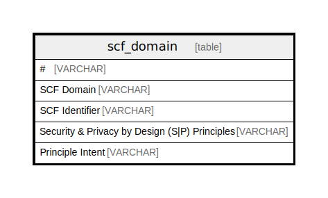

# scf_domain

## Description

<details>
<summary><strong>Table Definition</strong></summary>

```sql
CREATE TABLE scf_domain("# " VARCHAR, "SCF Domain" VARCHAR, "SCF Identifier" VARCHAR, "Security & Privacy by Design (S|P) Principles" VARCHAR, "Principle Intent" VARCHAR)
```

</details>

## Columns

| Name                                          | Type    | Default | Nullable | Comment |
| --------------------------------------------- | ------- | ------- | -------- | ------- |
| #                                             | VARCHAR |         | true     |         |
| SCF Domain                                    | VARCHAR |         | true     |         |
| SCF Identifier                                | VARCHAR |         | true     |         |
| Security & Privacy by Design (S|P) Principles | VARCHAR |         | true     |         |
| Principle Intent                              | VARCHAR |         | true     |         |

## Relations



---

> Generated by [tbls](https://github.com/k1LoW/tbls)
